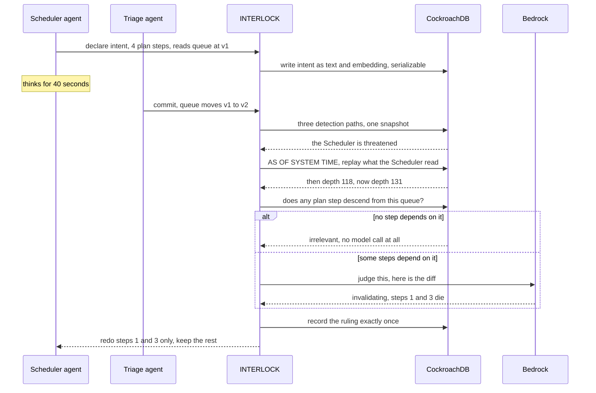
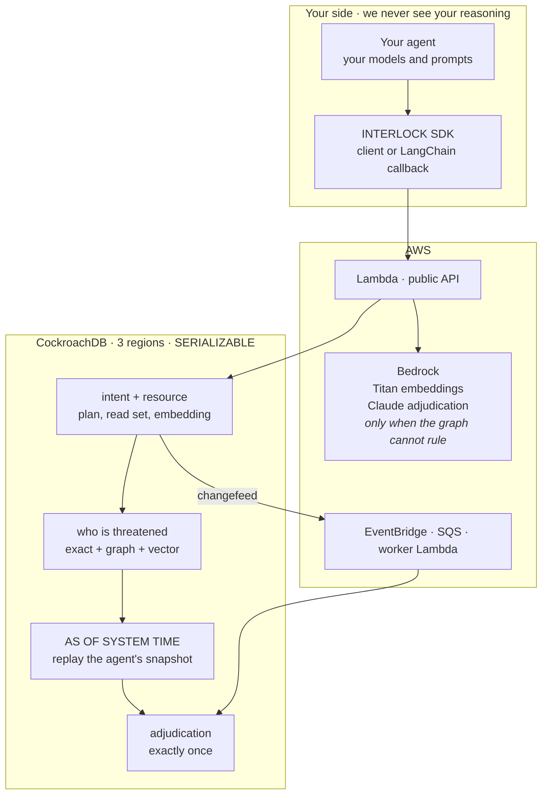

# INTERLOCK

**Agent memory that lets parallel agents think for 40 seconds without corrupting each other's work.**

Built on CockroachDB and AWS for the Build with Agentic Memory hackathon.

**[Live demo](https://d3dgn014prmcy8.cloudfront.net)** · **[API reference](docs/API.md)** · **[Setup](SETUP.md)** · MIT licence

---

## Try it in 30 seconds

You need Node and nothing else. No database, no AWS account, no configuration. The script issues itself a throwaway key and runs against our live service.

```bash
git clone https://github.com/usv240/interlock && cd interlock && npm install
npm run quickstart
```

```
1. Is the service up?
   healthy, 3 regions, survives region failure

3. The Scheduler says what it is about to do, before it does it
   intent declared with 4 plan steps

4. Meanwhile, Triage commits into the same queue

5. The ruling
   verdict   INVALIDATING       ruled by claude-haiku-4-5
   rationale The queue depth increased from 118 to 131, which changes the
             overflow calculation and the volume to hand to APAC.

   2 of 4 steps preserved. Optimistic concurrency would discard all 4.
   cost of this ruling: $0.002
```

Two more worth a minute:

| Command | What it shows |
|---|---|
| `npm run compare` | The same collision priced with and without INTERLOCK. Add `-- --reasoning 400` and it prints, in red, that we cost more below the crossover. |
| `npm run verify` | Issues a key and proves it is authenticated, tenant isolated, metered, and that garbage keys are refused. |

Everything above runs against the deployed system. Nothing is mocked or recorded.

---

## The problem, in plain terms

An AI agent does not behave like a database transaction. It reads some shared state, thinks for forty seconds, and then acts. In those forty seconds, another agent can change the very thing it was reasoning about.

Classical databases give you two options, and both are bad here:

- **Lock the row for the whole task.** Every other agent now waits out a full inference.
- **Detect the clash at the end and retry.** You throw away all forty seconds of reasoning.

We wanted numbers rather than opinions. The CoAgent paper ([arXiv:2606.15376](https://arxiv.org/abs/2606.15376)) measured this across ten contended workloads. Option two runs at **0.93x the speed of just running the agents one at a time, at 1.83x the token cost**.

So running agents in parallel today can be slower than not running them in parallel at all, and you pay nearly double for it.

Meanwhile parallel agents are shipping everywhere, and the industry's usual answer to two agents touching the same state is a git worktree and a merge conflict.

## The idea

Most conflicts do not actually matter.

If another agent changes a row your plan never depended on, your reasoning is still good. And when a change does matter, it usually breaks part of your plan, not all of it.

INTERLOCK is optimistic concurrency with two things swapped out:

- **Validation becomes reasoning** instead of a version check.
- **Abort becomes a surgical repair** instead of throwing everything away.

Correctness never depends on the model being right. The final write is a real `SERIALIZABLE` transaction, so a bad ruling costs you some wasted work. It never costs you a lost update.

---

## How it works

Five steps.

| Step | What happens | What does the work |
|---|---|---|
| **1. Declare** | The agent writes down what it read and what it plans to do, before acting. Stored as text and as an embedding. | Serializable write, `VECTOR(1024)` |
| **2. Watch** | A commit lands. Who is actually threatened? Three methods run in one query against one snapshot. | Recursive CTE joined with C-SPANN vector search |
| **3. Diff** | Replay the exact snapshot the agent read, and compare it to now. | `AS OF SYSTEM TIME` |
| **4. Adjudicate** | Irrelevant means proceed. Invalidating means repair only the dependent steps. Fatal means abort. | Provenance graph first, then Bedrock |
| **5. Resolve** | The ruling is recorded exactly once and acted on. | `SERIALIZABLE` plus a `UNIQUE` index |

### The three detection paths

```
exact     intents that read this very row at an older version
graph     recursive walk of the provenance graph, at step granularity
vector    nearest neighbour search over intent embeddings, which catches
          plans that share meaning but share no rows at all
```

All three run against the **same transactional snapshot**. That is the reason this lives inside CockroachDB rather than beside it.

### The graph answers first, for free

If no step in the plan descends from the changed resource, the recursive CTE rules it irrelevant with zero inference. A model is only consulted on what the graph could not settle.

This one change cut measured cost by roughly a third. We had been paying an expensive model to confirm conclusions a SQL query had already reached.

---

## What happens during a conflict



## Architecture



---

## Why CockroachDB and not something else

The database is the mechanism here, not the storage. Swap it out and the product stops existing.

| Alternative | Why it fails here |
|---|---|
| **PostgreSQL with pgvector** | Defaults to `READ COMMITTED`, so lost updates are possible unless every call site remembers to opt in. No point in time reads, so step 3 is impossible. Single region. |
| **Pinecone, Chroma, Weaviate** | No transactions at all. The similarity query and the graph query would see different states, which reintroduces exactly the consistency gap this system exists to close. |
| **Postgres plus a separate vector store** | Two systems, two snapshots. A commit visible in one and not the other silently produces the wrong blast radius. |
| **DynamoDB** | No joins, no recursive CTEs, no vector index. The provenance walk becomes application code. |

What is actually load bearing:

- **`SERIALIZABLE` by default.** Correctness is inherited from the database rather than reimplemented. Verify with `npm run db:verify`.
- **MVCC and `AS OF SYSTEM TIME`.** This is the mechanism, not a convenience. Without point in time reads there is no way to show an agent what moved underneath it.
- **A C-SPANN vector index sitting next to the transactional rows.** Semantic detection with no consistency gap.
- **Three regions with `SURVIVE REGION FAILURE`.** If the referee's memory is unavailable, the whole fleet is unsafe at once.

---

## CockroachDB tools used, all four

| Tool | What the agent actually does with it |
|---|---|
| **Distributed Vector Indexing** | One partial, tenant prefixed C-SPANN index covering only the intents currently in flight. Semantic detection never asks about resolved plans, so indexing them is write amplification for nothing. At roughly 1,700 live plans the planner selects it. Run `npm run ai:vector` to see the plan and the tenant it probed. The threshold was measured with `npm run ai:calibrate`, not guessed. |
| **Managed MCP Server** | Not a human console. It is a read only, audit logged tool belt for the adjudicating agent. Before ruling, it can ask one question, such as whether this resource has churned all morning or whether this is the first change in an hour. The channel cannot express a mutation. |
| **ccloud CLI and Cloud API** | A continuity agent that refuses to let adjudication run if the cluster is not genuinely configured to survive a region. It also reports `gc.ttlseconds` per table, which is the real ceiling on how far back a diff can read. |
| **Agent Skills** | Used for schema and index design. We wrote one back, `skills/managing-long-running-agent-transactions/`, carrying the traps that cost us real time. It ships in this repo. It is not upstream, and we would rather say so than imply a merge that has not happened. |

We also use changefeeds, row level TTL, recursive CTEs, follower reads on the audit feed, per table `gc.ttlseconds`, three different table localities (`GLOBAL`, `REGIONAL BY TABLE IN PRIMARY REGION`, and pinned), and a three region database with `SURVIVE REGION FAILURE`.

That comes to 11 migrations and 15 tables. The live data grows as people use the
public demo, and at the time of writing sits at roughly 1,900 intents, 1,600
provenance edges and 136 tenants.

## AWS services used

Only the services this project actually runs on. An earlier draft also listed ECS Fargate, which we designed for and never wired up. The rules require components to be meaningfully integrated rather than merely initialized, so claiming the services we use beats claiming ones we half use.

| Service | Role |
|---|---|
| **Amazon Bedrock** | Titan Text Embeddings V2 at 1024 dimensions for the vector path. Claude on two caller selectable tiers (`adjudicator: "bulk"` or `"adjudicator"`), named by role so your code survives a model id changing. The cheap tier is the default, because the provenance graph has already narrowed the question. A third tier exists in code and is deliberately not granted or published. Every call's tokens land in the ledger. |
| **AWS Lambda** | The public API, which declares intents, takes commits, adjudicates and enforces the spend ceiling. Function URL, no API Gateway. A second Lambda runs the async worker with capped concurrency, so the worker cannot starve the API. |
| **Amazon EventBridge and SQS** | Async adjudication driven off a CockroachDB changefeed, with a dead letter queue and partial batch failure handling. |
| **Amazon S3 and CloudFront** | Hosts the demo as a static export with a private origin. CloudFront only read via Origin Access Control, no public bucket policy. |
| **Amazon CloudWatch** | The logs, which caught a cold start syntax failure and a cross region IAM denial during the build. |
| **AWS Budgets** | A $20 monthly cap on the account, alerting at 50%, 80% and 100%. Alert-only by design: the enforcement that actually stops spending is in the API handler, since Budgets can only email. |
| **AWS IAM** | The runtime role is scoped to nine specific model and inference profile ARNs rather than `bedrock:*`, with explicit denies on deleting evidence and altering model access. Nine rather than two because a `us.` inference profile dispatches across regions, so least privilege means naming the underlying model in every region it may route to. See [`infra/`](infra/). |

### One cross region IAM lesson worth recording

Claude's `us.` inference profiles dispatch across regions. A policy allowing only `us-east-1` model ARNs fails at runtime with a denial naming `us-east-2`, because that is where the profile routed the call. Scoping least privilege correctly means allowing the underlying model in every region the profile may dispatch to, while the profile ARN itself stays in its home region.

---

## Results

Everything below was produced by the harness in this repo, against a live cluster. Reproduce with `npm run bench` and `npm run bench:sweep`.

### The crossover, including where we lose

INTERLOCK is not always better. The honest claim is a regime rather than a win.

```
reasoning/task    OCC cost    INTERLOCK cost    winner      margin
 3,357 tokens     2.06x       3.61x             OCC         -76%
 9,780 tokens     2.03x       2.12x             OCC          -5%
23,531 tokens     2.01x       1.47x             INTERLOCK   +27%
37,307 tokens     2.01x       1.31x             INTERLOCK   +35%
```

**Below roughly 12,000 tokens of reasoning per task, do not use this. Just retry.**

The 9,780 row is the interesting one. The two approaches sit within 5% of each other, which is where the decision is genuinely hard rather than obvious.

The reason is structural. Adjudicating a conflict costs roughly a fixed amount. Re running a task costs in proportion to how much thinking it discards. Cheap tasks have nothing worth protecting, so the saving grows with task cost.

### Correctness

**Zero lost updates in every mode at every point on the curve.** This is checked by arithmetic rather than inspection. Each resource carries a counter, and a correct run must satisfy `final_counter == successful_commits`.

### Chaos drill

`npm run chaos` destroys every in flight connection at random moments while agents are adjudicating.

```
13 kill waves fired | 6 commits | 6 tasks completed | 0 abandoned

PASS  exactly-once adjudication (0 duplicate pairs)
PASS  no orphaned repairs (0)
PASS  counter balances: 6 increments for 6 commits
PASS  nothing left mid-flight (0 threatened)
```

The wave count varies per run because kills fire at random moments, so expect something in the low teens rather than that exact number.

**The fourth check used to be a global count, and that was wrong.** It asked whether any intent anywhere in the database sat in `threatened`, so an afternoon of running the test suite made it report 15 on a run that had left 4. It had been passing because the cluster happened to be clean, not because the property held. It is now scoped to the drill's own agents, as the other three always were.

It also no longer asserts zero unconditionally. An intent left `threatened` after a connection dies mid adjudication is recoverable, not corrupt. The sequence is mark, then adjudicate, then record. A kill between the first and last leaves the middle state, with nothing lost and nothing doubled, because the changefeed redelivers and the `UNIQUE` index makes the retry a no op. Asserting zero would have been asserting that a random kill never lands mid sequence, which is precisely what this drill exists to cause.

**What this proves and what it does not.** CockroachDB Basic is managed, so we cannot take a region offline, and a script claiming to would be theatre. The database's half of the guarantee, surviving region loss, is a configuration property and is verified declaratively as three regions with survival goal region. Our half, behaving correctly when the database becomes unreachable mid decision, is what the drill attacks. From an application's point of view, a region loss is connections dying mid flight.

Exactly once is structural rather than conventional. A `UNIQUE` index on `(commit_id, intent_id)` means a double apply fails loudly instead of quietly recording two verdicts for one conflict.

---

## Using it from your own agents

**Full API reference: [docs/API.md](docs/API.md).**

INTERLOCK is a service, not a framework. Your agents keep their own models, prompts and tools. It arbitrates shared state and nothing else.

Worth being explicit about what that means, because it decides whether this fits your architecture:

- **We run the inference.** You do not bring a model or a model key. When a commit threatens an in flight plan, we call Bedrock on our account to judge whether the plan actually broke. You are metered, not billed.
- **We never see your agent's reasoning.** Only a one sentence intent, a read set, and a step list.
- **Most conflicts never reach a model.** The provenance graph settles them for free, and a ruling marked `model: "provenance-graph"` cost nothing.
- **You can choose who rules.** Set `adjudicator: "bulk"` or `"adjudicator"` on a commit, named by role rather than model id. `GET /v1/health` publishes what is available. Unknown values are refused rather than silently downgraded.
- **This is not an inference proxy.** If you want somewhere to run your model calls, this is the wrong service.

```js
import { Interlock } from "./sdk/client.js";

const { key } = await Interlock.issueKey({ name: "My Fleet" });
const il = new Interlock({ apiKey: key });

const agent = await il.registerAgent({ name: "Scheduler" });
const queue = await il.registerResource({ key: "support-eu", body: { depth: 118 } });

// 1. say what you are about to do, before you do it
const { intent } = await il.declare({
  agentId: agent.id,
  statement: "Rebalance the EU queue and page a second responder.",
  reads: [{ resourceId: queue.id, observedVersion: queue.version }],
});

// 2. commit through us
const { adjudications } = await il.commit({
  agentId: agent.id,
  intentId: intent.id,
  resourceId: queue.id,
  body: { depth: 131 },
  statement: "Depth rose to 131.",
});

// 3. act on the ruling. It names which steps died, not just that something did.
for (const a of adjudications) {
  if (a.verdict === "invalidating") redo(a.affectedSteps);
}
```

The client is dependency free `fetch`, so it runs on Node, Deno, Bun, workers and browsers.

### LangChain

A LangChain agent already tells its callbacks what it is about to do, which is exactly what INTERLOCK needs. So the integration is a callback rather than a rewrite.

```js
import { InterlockCallback } from "./sdk/langchain.js";

const guard = new InterlockCallback({ apiKey, agentId, resources });
await executor.invoke(input, { callbacks: [guard] });

if (guard.wasInvalidated) redo(guard.stepsToRedo);
```

Tool calls are recorded as plan steps as they happen, which is what lets a conflict be repaired at step granularity instead of throwing the whole task away. Run `npm run example:langchain` to watch two agents contend over one queue.

If declaring fails, the callback warns and lets the run continue. A guard that breaks the run it is guarding is worse than no guard.

---

## Everything you can run

**No setup required.** These use our live deployment:

| Command | What it does |
|---|---|
| `npm run quickstart` | The whole loop: declare, collide, ruling |
| `npm run compare` | The same collision priced with and without INTERLOCK |
| `npm run verify` | Proves a key is authenticated, isolated and metered |
| `npm run example:langchain` | Two LangChain agents contending over one queue |
| `npm run test:sdk` | 13 contract checks against the live endpoint |
| `npm run submission:check` | Is everything a judge can touch still working? |

**Needs your own cluster.** See [SETUP.md](SETUP.md):

| Command | What it does |
|---|---|
| `npm run db:migrate` and `db:reset` | Apply or rebuild the schema |
| `npm run db:verify` | Proves serializable, 3 regions, time travel and the vector index |
| `npm run demo` | The mechanism end to end, locally, with full accounting |
| `npm run bench` and `bench:sweep` | Four modes on one workload, and the crossover curve |
| `npm run chaos` | The connection severing resilience drill |
| `npm run ai:probe`, `ai:calibrate`, `ai:vector` | Bedrock reachability, threshold, index selection |
| `npm run test:isolation` and `test:tiers` | Tenant isolation and model tier routing |
| `npm run continuity`, `mcp`, `pipeline` | ccloud preflight, MCP tools, async pipeline health |
| `npm run revoke:key` | Revoke an issued key, or list recent keys and their state |

Frontend: `cd web && npm install && npm run dev`

---

## Run the whole stack on your own infrastructure

The commands at the top use our deployment. This is the path if you want to change the mechanism rather than call it.

You need Node 20 or newer, a CockroachDB Cloud cluster on v25.2 or newer (below that there is no vector index), and AWS credentials with Bedrock access. **[SETUP.md](SETUP.md)** walks through obtaining every credential step by step.

```bash
cp .env.example .env.local                # then fill it in, see SETUP.md
npm run db:migrate && npm run db:verify   # schema, then proof it does what we claim
npm run demo                              # the mechanism end to end, locally
npm run api:deploy && npm run deploy      # your own API and site
```

---

## Honest limitations

Stated here rather than buried, because a reproducible benchmark is only a strength if we stand behind what it prints.

1. **INTERLOCK loses below the crossover.** At around 3,400 tokens of reasoning per task it costs 3.61x against optimistic concurrency's 2.06x. That is a real result, published above rather than tuned away.
2. **The workload's dependency fraction and pass count are parameters we chose.** The first version had every step depend on the contended value, which is the worst possible case and unrepresentative. Both are now explicit and swept, but they are still our choices, so the whole curve including the losing region is published for inspection.
3. **The vector index is only selected above a few thousand in flight plans.** It is a partial index covering plans still in flight, because semantic detection never asks about resolved ones. At 1,695 live plans in a tenant the planner picks it, and `npm run ai:vector` prints the plan and the tenant it probed. Below that a scan genuinely wins and CockroachDB is right to prefer it, so `npm run db:verify` also forces the index, which is the only way to tell an index that is resting from one that is dead.

   We have had both kinds of dead. The index was built for L2 while every query asked in cosine. Once that was fixed, it was selected only for unfiltered queries that nothing in this system runs. And then the corpus we seeded to prove it works was written with status `aborted`, which put all 1,741 rows outside the partial index. Every statement true, conclusion still wrong.
4. **We cannot take down a managed region.** See the chaos drill section for exactly which half of the guarantee is tested here.
5. **Energy figures are estimates.** A single coefficient in watt hours per 1,000 tokens is applied uniformly to every mode. The absolute number may be wrong, but the comparison stays valid because every mode is multiplied by the same figure. Override it with `ENERGY_WH_PER_1K_TOKENS`.

---

## Availability for judging

The demo and API are free, unauthenticated where it matters, and stay up through the judging period. `npm run submission:check` verifies from the outside, covering the site, the API, the budget, the full declare to commit to ruling loop, and whether the public repo is current. It exits non zero if a judge would hit a failure.

Ceilings are set far above anything judging can produce, and are visible on `GET /v1/health`:

| Scope | Ceiling | Roughly |
|---|---|---|
| Anonymous, per address | 3,000 calls, $10/day | more than a person can click |
| Per key, per tenant | 10,000 calls, $25/day | more than a fleet needs |
| Everyone, per day | $50 | about 25,000 adjudications |
| **Everyone, per month** | **$25** | **about 12,000 adjudications** |

The monthly figure is the one that actually bounds a bill, and it is deliberately the tightest. Daily caps reset, so on their own they bound nothing anybody is ever charged for. Fifty dollars a day is $1,500 a month, and every one of those days would report itself as working. Judging realistically costs a few dollars: a hundred judges running the demo twenty times each is about $4.

The ceilings are not removed, and that is deliberate. `/v1/demo` and `/v1/keys` are unauthenticated so anyone can evaluate this without asking permission, which means a crawler has the same access a judge does. A ceiling nobody legitimate can reach costs nothing. No ceiling at all is an unbounded bill with nobody watching it for a month.

This is enforcement rather than warning. Every Bedrock call goes through the handler that checks it, whereas AWS Budgets only sends email. `GET /v1/health` and `POST /v1/keys` keep working if a ceiling is reached, and the 429 says which ceiling and when it resets.

---

## Provenance and disclosures

The rules require entrants to disclose any pre existing code or work incorporated into the project, and separately permit standard development tools including frameworks, libraries, starter templates and AI coding assistants. Both, in full:

- **Nothing predates the submission period.** There is no earlier codebase underneath this one, and no pre existing code or work was incorporated. That is the disclosure the rules ask for, and the answer is none.
- **Original work, solely owned.** Every design decision, the benchmark methodology, and every published figure was made and verified by the entrant against a live cluster. Standard development tooling was used throughout, including an AI coding assistant, which is explicitly permitted and noted here because this project publishes what it did rather than only what flatters it.
- **CockroachDB Agent Skills were consumed** for schema and index design, as the hackathon intends. `skills/managing-long-running-agent-transactions/` is ours, written in return. It ships here and is not upstream.
- **Prior art is cited, not incorporated.** The baseline figures in the benchmark are CoAgent's published numbers, labelled `published` wherever they appear and kept visually distinct from figures our own harness produced. No code from any cited paper is used.
- **Dependencies** are standard open source packages under permissive licences: `pg`, `@aws-sdk/*`, `@langchain/core`, Next.js, React and Tailwind. See `package.json` and `web/package.json`.

## References

- **CoAgent: Concurrency Control for Multi-Agent Systems**, [arXiv:2606.15376](https://arxiv.org/abs/2606.15376). Source of the baseline figures and of the core idea that an LLM can judge whether a conflicting write invalidates its plan.
- **ATM: CID-Brokered Pre-Write Admission for Multi-Agent Code Co-Synthesis**, [arXiv:2607.00041](https://arxiv.org/pdf/2607.00041)
- **Verified Detection and Prevention of Concurrency Anomalies in Multi-Agent LLM Systems**, [arXiv:2606.17182](https://arxiv.org/pdf/2606.17182)
- **Early Diagnosis of Wasted Computation in Multi-Agent LLM Systems**, [arXiv:2606.01365](https://arxiv.org/html/2606.01365v2)

CoAgent published the algorithm. This is an independent open source implementation on a serializable distributed database, benchmarked against its reported numbers.

## License

MIT, see [LICENSE](LICENSE).
